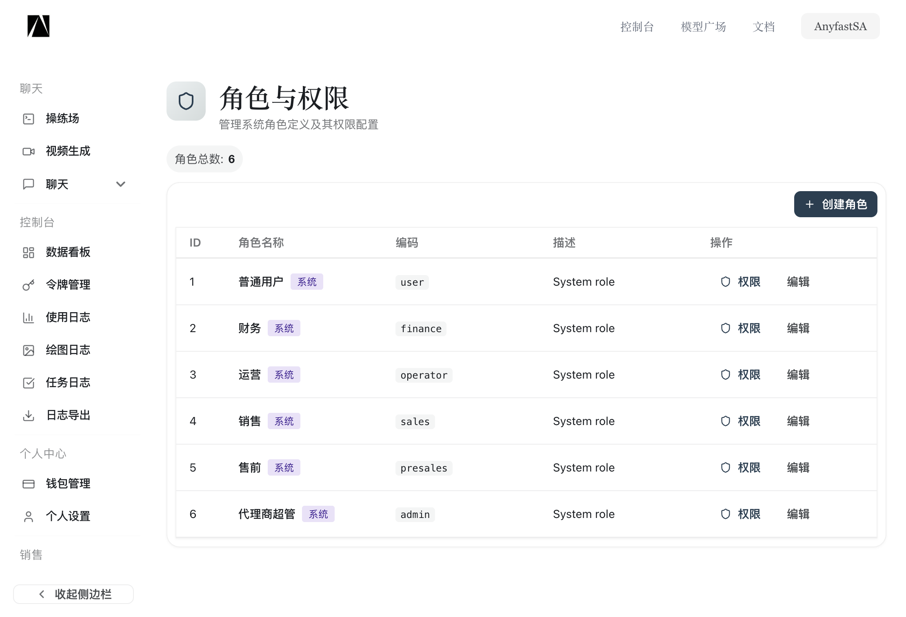
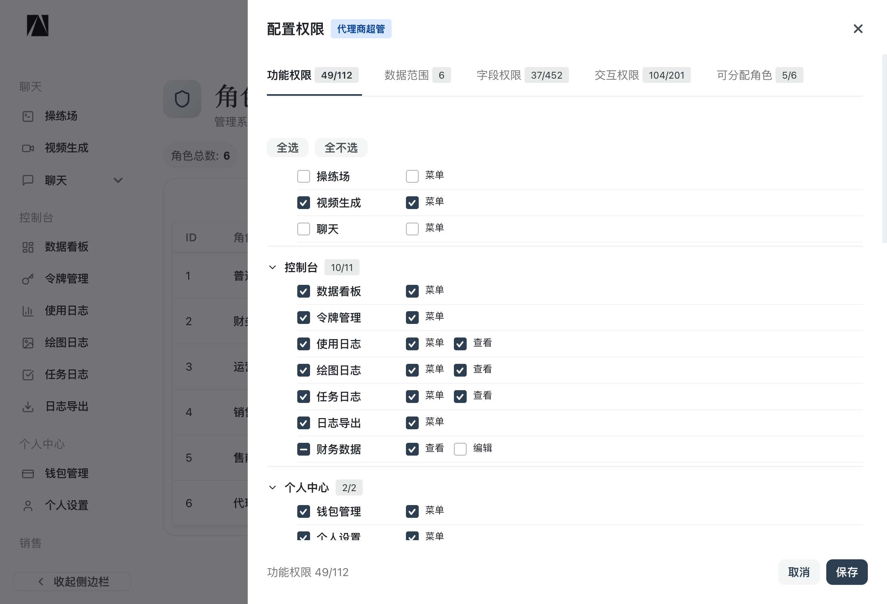
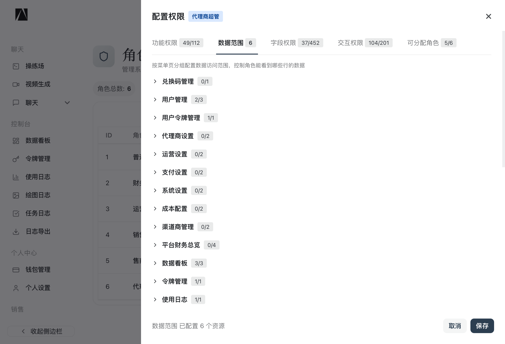
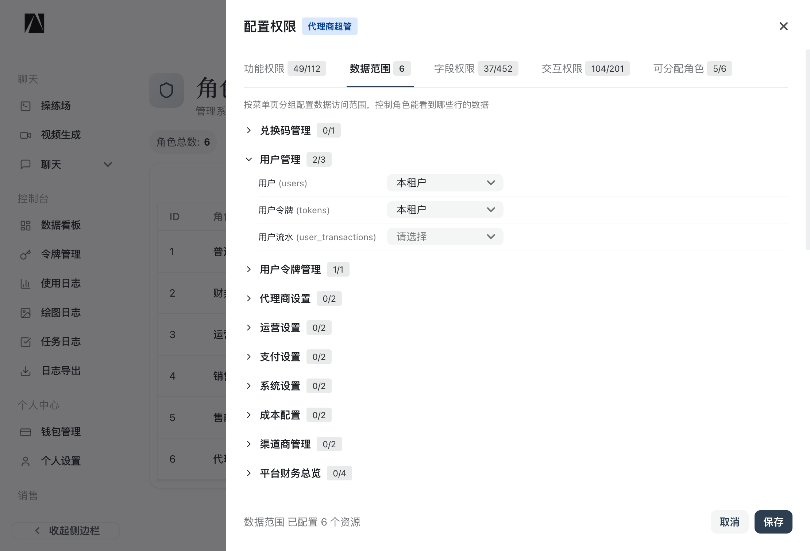
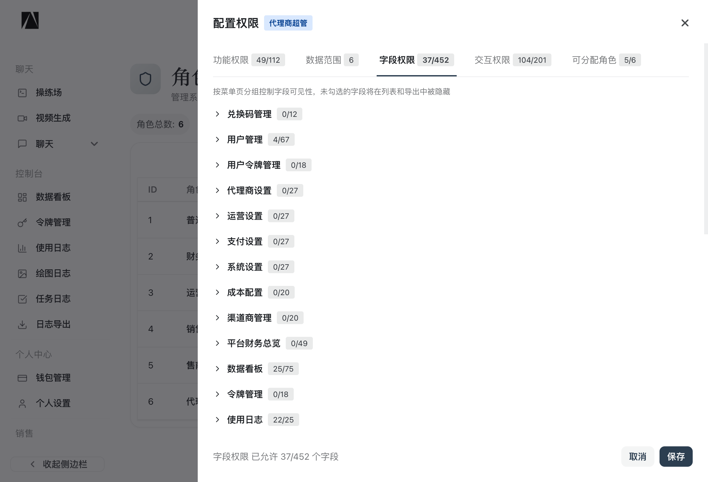
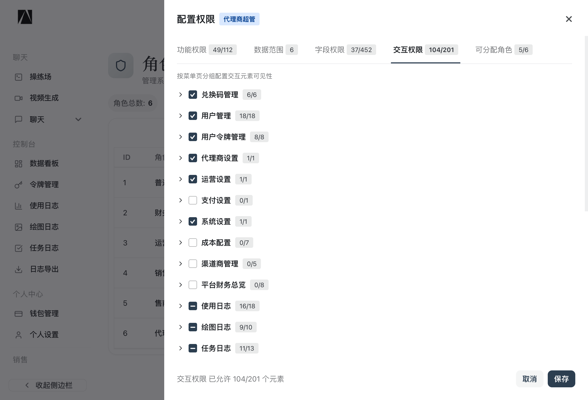
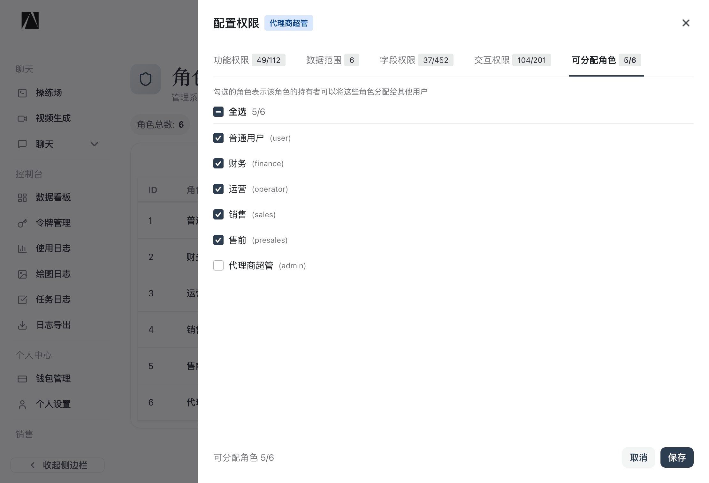

# Anyfast 权限系统配置指南

> 本文档面向系统管理员，详细说明如何配置角色权限。权限系统采用五维控制模型，覆盖从菜单可见性到字段级数据隐藏的全部场景。

---

## 目录

1. [概览：五维权限模型](#1-概览五维权限模型)
2. [角色列表页](#2-角色列表页)
3. [功能权限（Tab 1）](#3-功能权限tab-1)
4. [数据范围（Tab 2）](#4-数据范围tab-2)
5. [字段权限（Tab 3）](#5-字段权限tab-3)
6. [交互权限（Tab 4）](#6-交互权限tab-4)
7. [可分配角色（Tab 5）](#7-可分配角色tab-5)
8. [内置角色与默认配置](#8-内置角色与默认配置)
9. [权限生效流程](#9-权限生效流程)
10. [常见配置场景](#10-常见配置场景)
11. [注意事项与 FAQ](#11-注意事项与-faq)

---

## 1. 概览：五维权限模型

系统的权限控制分为五个独立维度，每个维度解决不同层面的访问控制问题：

```
┌─────────────────────────────────────────────────────────────┐
│                    五维权限模型                               │
├─────────────┬───────────────────────────────────────────────┤
│  功能权限    │ 控制"能不能访问这个页面/功能"                    │
│  (API 级)   │ 例：能否打开渠道管理页、能否创建用户              │
├─────────────┼───────────────────────────────────────────────┤
│  数据范围    │ 控制"能看到哪些行的数据"                         │
│  (行级)     │ 例：只看自己的日志 vs 看全租户的日志               │
├─────────────┼───────────────────────────────────────────────┤
│  字段权限    │ 控制"能看到哪些列/字段"                          │
│  (列级)     │ 例：隐藏渠道密钥、隐藏平台成本                    │
├─────────────┼───────────────────────────────────────────────┤
│  交互权限    │ 控制"页面上的按钮和操作是否可见"                   │
│  (UI 级)    │ 例：隐藏导出按钮、隐藏删除按钮                    │
├─────────────┼───────────────────────────────────────────────┤
│  可分配角色  │ 控制"能把哪些角色分配给其他用户"                   │
│  (委派级)   │ 例：admin 可以分配 sales，但不能分配 admin        │
└─────────────┴───────────────────────────────────────────────┘
```

**安全原则**：后端是安全边界，前端仅做 UX 便利。五个维度在后端均有强制校验，前端隐藏只是锦上添花。

### 五维之间的依赖关系与配置顺序

五个维度并非完全独立——**功能权限（Tab 1）是其余四个维度的前置条件**：

```
功能权限（Tab 1）
  │
  │  未勾选某功能 → 用户无法进入该页面 → 后续 Tab 的配置不会生效
  │
  ├──▶ 数据范围（Tab 2）  ← 依赖 Tab 1：页面都进不去，配了行级范围也无意义
  ├──▶ 字段权限（Tab 3）  ← 依赖 Tab 1：接口都调不了，配了列级隐藏也无意义
  ├──▶ 交互权限（Tab 4）  ← 依赖 Tab 1：页面不渲染，配了按钮显隐也无意义
  └──▶ 可分配角色（Tab 5） ← 依赖 Tab 1 中的 assign_role 动作
```

**推荐配置顺序**：

| 步骤 | Tab | 决定什么 | 不配的后果 |
|---|---|---|---|
| 1 | 功能权限 | 能进哪些页面、能调哪些接口 | 页面不可见，后续配置全部无效 |
| 2 | 数据范围 | 能看到哪些行 | 安全降级为"仅自己" |
| 3 | 字段权限 | 能看到哪些列 | 所有字段返回零值 |
| 4 | 交互权限 | 能用哪些按钮 | 按钮不显示 |
| 5 | 可分配角色 | 能给别人分配哪些角色 | 无法分配角色 |

> **常见误区**：在 Tab 2/3/4 里配置了某个功能的权限，但忘记在 Tab 1 里勾选该功能的"菜单"和"查看"——结果用户连页面都看不到，后面的配置全部浪费。**务必先完成 Tab 1，再配置其他 Tab。**

---

## 2. 角色列表页

**路径**：控制台 → 角色与权限（`/console/role`）



### 页面说明

| 列 | 说明 |
|---|---|
| **ID** | 角色的数据库自增 ID |
| **角色名称** | 显示名称，带"系统"标签表示内置角色 |
| **编码** | 角色唯一标识符（`user`、`admin`、`sales` 等） |
| **描述** | 角色用途简述 |
| **操作** | **权限** — 打开五维权限配置面板；**编辑** — 修改角色名称和描述 |

### 操作说明

- **创建角色**：点击右上角"创建角色"按钮，输入角色名称、编码和描述。编码一旦创建不可修改。
- **配置权限**：点击角色行的"权限"按钮，打开权限配置抽屉面板，包含 5 个 Tab 页。
- **编辑角色**：修改角色的显示名称和描述，不影响已配置的权限。

> **提示**：带"系统"标签的内置角色（`user`、`finance`、`operator`、`sales`、`presales`、`admin`）不可删除，但可以修改其权限配置。

---

## 3. 功能权限（Tab 1）

**作用**：控制角色能够访问哪些功能模块和执行哪些操作。



### 界面结构

权限按功能模块分组显示，每个模块的标题旁显示已勾选数 / 总数（如 `10/11`）。

每个功能项可以有以下动作类型的复选框：

| 动作 | 含义 | 典型用途 |
|---|---|---|
| **菜单** | 侧边栏是否显示该菜单项 | 控制页面入口可见性 |
| **查看** | 能否读取该功能的数据 | 控制列表/详情 API 访问 |
| **创建** | 能否新建记录 | 控制创建按钮和 API |
| **编辑** | 能否修改记录 | 控制编辑操作和 API |
| **删除** | 能否删除记录 | 控制删除操作和 API |
| **assign_role** | 能否分配角色 | 仅用户管理页面 |
| **assign_perm** | 能否配置权限 | 仅角色管理页面 |

### 功能模块分组

系统将功能按业务模块分为以下几组：

#### 聊天（3 项）
| 功能 | 可选动作 | 说明 |
|---|---|---|
| 操练场 | 菜单 | AI 对话测试工具 |
| 视频生成 | 菜单 | 视频生成功能入口 |
| 聊天 | 菜单 | 聊天对话功能入口 |

#### 控制台（11 项）
| 功能 | 可选动作 | 说明 |
|---|---|---|
| 数据看板 | 菜单 | 首页数据仪表盘 |
| 令牌管理 | 菜单 | 个人 API 令牌管理 |
| 使用日志 | 菜单、查看 | API 调用日志 |
| 绘图日志 | 菜单、查看 | Midjourney 等绘图任务日志 |
| 任务日志 | 菜单、查看 | 异步任务执行日志 |
| 日志导出 | 菜单 | 日志批量导出功能 |
| 财务数据 | 查看、编辑 | 代理商财务数据（无菜单，嵌入其他页面） |

#### 个人中心（2 项）
| 功能 | 可选动作 | 说明 |
|---|---|---|
| 钱包管理 | 菜单 | 充值、余额、交易记录 |
| 个人设置 | 菜单 | 密码、OAuth 绑定、2FA、Passkey |

#### 销售（8 项）
| 功能 | 可选动作 | 说明 |
|---|---|---|
| 客户管理 | 菜单、查看、创建、编辑 | CRM 客户列表与跟进 |
| 留资管理 | 菜单、查看、编辑、删除 | 网站留资线索管理 |

#### 管理后台（25 项）
| 功能 | 可选动作 | 说明 |
|---|---|---|
| 兑换码管理 | 菜单、查看、创建 | 兑换码批量生成与管理 |
| 用户管理 | 菜单、查看、创建、编辑、删除、assign_role | 全量用户 CRUD + 角色分配 |
| 用户令牌管理 | 菜单、查看、创建、编辑、删除 | 管理所有用户的 API 令牌 |
| 代理商设置 | 菜单、查看、编辑 | 当前代理商的基本配置 |
| 充值管理 | 查看、创建 | 管理用户充值操作 |

#### 平台管理（45 项）
| 功能 | 可选动作 | 说明 |
|---|---|---|
| 代理商管理 | 菜单、查看、创建、编辑、删除 | 多租户代理商 CRUD |
| 模型管理 | 菜单、查看、创建、编辑、删除 | AI 模型配置 |
| 模型定价设置 | 菜单、查看、编辑 | 模型分组定价 |
| 渠道可用性 | 菜单 | 渠道健康状态一览 |
| 渠道管理 | 菜单、查看、创建、编辑、删除 | 上游 AI 渠道配置 |
| 系统设置 | 菜单 | 全局系统参数 |
| 订阅管理 | 菜单、查看、创建、编辑、删除 | 订阅计划管理 |
| 模型部署 | 菜单、查看、创建、编辑、删除 | 模型实例部署 |
| 角色与权限 | 菜单、查看、创建、编辑、删除、assign_perm | 本页面自身的管理权限 |
| 功能权限配置 | 菜单、查看、创建、编辑、删除 | 权限元数据管理 |

#### 财务审计（17 项）
| 功能 | 可选动作 | 说明 |
|---|---|---|
| 成本配置 | 菜单、查看、创建、编辑、删除 | 渠道成本方案管理 |
| 渠道商管理 | 菜单、查看、创建、编辑、删除 | 供应商关系管理 |
| 平台财务总览 | 菜单、查看、编辑 | 每日统计、对账单、趋势 |
| 供应商管理 | 查看、创建、编辑、删除 | 供应商内部管理（无菜单） |

### 快捷操作

- **全选 / 全不选**：顶部的快捷按钮，一键勾选或清空所有权限。
- **模块级复选框**：每个模块标题旁的复选框可以整组勾选/取消。
- **特殊权限 — 全部权限**：底部的"全部权限"复选框等同于 `platform:*`，赋予角色所有页面和所有操作的完整权限。

### 配置示例

**场景：给"销售"角色添加查看使用日志的权限**

1. 打开"销售"角色的权限面板
2. 在"控制台"分组中，找到"使用日志"
3. 勾选"菜单"（显示侧边栏入口）和"查看"（允许读取日志数据）
4. 点击"保存"

保存后，该角色的用户刷新页面即可在侧边栏看到"使用日志"入口。

---

## 4. 数据范围（Tab 2）

**作用**：控制角色能看到哪些**行**的数据（行级过滤）。即使有功能权限可以进入某个页面，数据范围决定了该页面能查到多少条记录。



展开某个分组后可以看到具体资源和下拉选项：



### 界面结构

- 按**菜单页分组**展示资源列表，标题旁显示已配置数 / 总资源数（如 `2/3`）
- 点击分组标题可展开/收起
- 每个资源（如 `users`、`tokens`、`user_transactions`）对应一个下拉选择器

### 数据范围类型

| 范围类型 | 显示名 | 含义 | SQL 效果 |
|---|---|---|---|
| **全部** | 全部 | 可以看到系统内所有数据 | 不加任何过滤条件 |
| **本租户** | 本租户 | 只能看到自己所属代理商下的数据 | `WHERE agent_id = 当前代理商ID` |
| **自己** | 仅自己 | 只能看到自己创建/归属的数据 | `WHERE user_id = 当前用户ID` |
| **自己和下属** | 自己+下属 | 看到自己和自己管理的下属用户的数据 | `WHERE user_id IN (自己, 下属1, 下属2...)` |
| **自定义** | 自定义 | 管理员手动指定的代理商/用户列表 | `WHERE agent_id IN (指定列表)` |
| **请选择** | （未配置） | 没有配置数据范围 | 安全降级，见下方说明 |

### 重要：未配置数据范围的默认行为

当某个资源的数据范围显示"**请选择**"（即未配置），系统采用**安全降级策略**：

```
未配置 → GetEffectiveDataScope() 返回 "none"
     → 服务层安全降级为 "self"（仅看自己）
     → SQL: WHERE user_id = 当前用户ID
```

**结论**：未配置 ≠ 能看全部数据。未配置 = 只能看自己的数据。这是系统的安全设计——宁可少给权限，不会多给。

### 资源分组与资源列表

以下是各菜单页分组包含的资源：

| 分组 | 资源 | 说明 |
|---|---|---|
| **兑换码管理** | redemptions | 兑换码记录 |
| **用户管理** | users, tokens, user_transactions | 用户、令牌、用户流水 |
| **用户令牌管理** | tokens | 令牌 |
| **代理商设置** | agents, agent_options | 代理商基本信息和配置 |
| **运营设置** | agents, agent_options | 运营相关配置 |
| **支付设置** | agents, agent_options | 支付相关配置 |
| **系统设置** | agents, agent_options | 系统级配置 |
| **成本配置** | cost_plans, model_group_pricings | 成本方案和模型定价 |
| **渠道商管理** | suppliers, cost_plans | 渠道商和成本方案 |
| **平台财务总览** | billing_daily_stats, billing_statements, agent_transactions, channel_transactions | 财务四大资源 |
| **数据看板** | logs, tasks, midjourney | 仪表盘统计来源 |
| **令牌管理** | tokens | 个人令牌 |
| **使用日志** | logs | 使用日志 |
| **绘图日志** | midjourney | 绘图日志 |
| **任务日志** | tasks | 任务日志 |
| **日志导出** | logs | 导出的日志 |
| **财务数据** | agent_transactions, billing_statements | 代理商财务 |
| **钱包管理** | topups, user_transactions | 充值和流水 |
| **个人设置** | users, oauth_bindings, twofa, passkeys, checkins | 个人相关资源 |
| **代理商管理** | agents, agent_options, agent_pricings, agent_model_price_ratios, agent_transactions, billing_statements, agent_channels | 代理商全量资源 |
| **模型管理** | models, model_group_pricings, vendors | 模型和定价 |
| **渠道管理** | channels, suppliers | 渠道和供应商 |
| **订阅管理** | subscription_plans, subscription_orders | 订阅计划和订单 |
| **客户管理** | users | CRM 客户 |
| **留资管理** | contact_inquiries | 留资线索 |

### 配置示例

**场景：让"代理商超管"角色能看到用户管理下的所有用户流水**

1. 打开"代理商超管"角色的权限面板 → 数据范围 Tab
2. 展开"用户管理"分组
3. 将"用户流水 (user_transactions)"从"请选择"改为"本租户"
4. 保存

修改前：admin 角色的用户在用户管理页面看不到用户流水（降级为仅自己）。
修改后：admin 角色的用户可以看到本代理商下所有用户的流水。

---

## 5. 字段权限（Tab 3）

**作用**：控制角色能看到哪些**列/字段**（列级过滤）。即使有权限进入页面、也能看到行数据，但某些敏感字段可以被隐藏。



### 界面结构

- 按资源分组展示，标题旁显示已允许字段数 / 总字段数（如 `25/75`）
- 点击分组可展开查看具体字段
- 每个字段一个复选框：**勾选 = 可见**，**不勾选 = 隐藏**

### 资源字段分组

| 分组 | 字段数 | 包含的典型敏感字段 |
|---|---|---|
| **兑换码管理** | 12 | - |
| **用户管理** | 67 | access_token, stripe_customer, model_discount, quota |
| **用户令牌管理** | 18 | key (令牌密钥) |
| **代理商设置** | 27 | - |
| **运营设置** | 27 | - |
| **支付设置** | 27 | - |
| **系统设置** | 27 | - |
| **成本配置** | 20 | - |
| **渠道商管理** | 20 | - |
| **平台财务总览** | 49 | - |
| **数据看板** | 75 | channel_id, channel_name, platform_quota, admin_info, ip |
| **令牌管理** | 18 | - |
| **使用日志** | 25 | channel_id, agent_id, platform_quota, ip, admin_info |
| **客户管理** | 1 | - |

### 字段隐藏的效果

当某个字段被设为不可见时，系统在**三个层面**同时生效：

1. **后端 API 响应**：该字段的值被置零/清空（不会从 JSON 中删除字段，但值为空）
2. **前端表格列**：该字段对应的列不显示，且无法通过列选择器打开
3. **前端导出**：导出字段选择器中不会出现该字段

### 配置示例

**场景：不让"销售"角色看到使用日志中的渠道信息和平台成本**

1. 打开"销售"角色权限面板 → 字段权限 Tab
2. 展开"使用日志"分组
3. 取消勾选：`channel_id`、`channel_name`、`platform_quota`、`agent_id`
4. 保存

效果：销售角色的用户打开使用日志页面后，表格中不会显示渠道和平台成本相关的列，导出时也无法选择这些字段。

---

## 6. 交互权限（Tab 4）

**作用**：控制页面上具体的**按钮和交互元素**是否可见（UI 元素级控制）。



### 界面结构

- 按功能分组，标题旁显示已启用数 / 总元素数（如 `18/19`）
- 每个元素一个复选框：**勾选 = 可见**，**不勾选 = 隐藏**

### 元素类型标记

UI 中每个元素会标记其类型：

| 类型 | 颜色 | 含义 | 示例 |
|---|---|---|---|
| **button** | 蓝色 | 操作按钮 | 创建、删除、导出 |
| **input** | 绿色 | 输入/搜索框 | 搜索框、过滤器 |
| **section** | 橙色 | 页面区域 | 统计面板、Tab 页 |
| **action** | 紫色 | 行级操作 | 编辑、复制、切换状态 |
| **link** | 灰色 | 链接/跳转 | 详情链接 |

### 主要功能的交互元素

#### 使用日志（16 个元素）
| 元素 | 类型 | 说明 |
|---|---|---|
| search | input | 搜索框 |
| reset | button | 重置筛选 |
| refresh | button | 刷新数据 |
| export | button | 导出日志 |
| column_settings | button | 列设置 |
| compact_mode | button | 紧凑模式切换 |
| filters | section | 高级筛选面板 |
| stat_panel | section | 统计信息面板 |
| view_detail | action | 查看详情 |
| retry | action | 重试请求 |

#### 用户管理（19 个元素）
| 元素 | 类型 | 说明 |
|---|---|---|
| create | button | 创建用户 |
| search | input | 搜索框 |
| edit | action | 编辑用户 |
| delete | action | 删除用户 |
| toggle_status | action | 启用/禁用 |
| assign_role | action | 分配角色 |
| reset_password | action | 重置密码 |
| topup | action | 充值操作 |
| manage_subscriptions | action | 管理订阅 |
| batch_operations | button | 批量操作 |

#### 渠道管理（18+ 个元素）
| 元素 | 类型 | 说明 |
|---|---|---|
| create | button | 创建渠道 |
| edit | action | 编辑渠道 |
| delete | action | 删除渠道 |
| test | action | 测试渠道 |
| clone | action | 克隆渠道 |
| batch_delete | button | 批量删除 |
| test_all | button | 全部测试 |
| balance_section | section | 余额信息区域 |

### 配置示例

**场景：允许"运营"角色查看使用日志但禁止导出**

1. 打开"运营"角色权限面板 → 交互权限 Tab
2. 展开"使用日志"分组
3. 确保大部分元素勾选（search、refresh、view_detail 等）
4. 取消勾选 `export`（导出按钮）
5. 保存

效果：运营角色的用户可以查看使用日志、搜索筛选、查看详情，但页面上不会显示导出按钮。

---

## 7. 可分配角色（Tab 5）

**作用**：控制该角色的持有者可以将哪些角色分配给其他用户。这是一种**权限委派**控制，防止低权限角色越权提升他人权限。



### 界面结构

- 列出系统中所有角色，每个角色一个复选框
- **勾选 = 可以将该角色分配给其他用户**
- 顶部有"全选"快捷操作

### 设计原则

- **不能分配自己**：角色不应该能将同级别角色分配给他人（防止权限扩散）
- **不能分配上级**：低权限角色不能创建/分配高权限角色
- **层级控制**：admin 可以分配 operator、sales、presales、finance、user，但不能分配 admin

### 默认配置

| 角色 | 可分配的角色 |
|---|---|
| **代理商超管 (admin)** | 普通用户、财务、运营、销售、售前 |
| **销售 (sales)** | 普通用户 |
| **其他角色** | 无（不能分配角色给他人） |

### 配置示例

**场景：允许"运营"角色也能给用户分配"普通用户"和"销售"角色**

1. 打开"运营"角色权限面板 → 可分配角色 Tab
2. 勾选"普通用户 (user)"和"销售 (sales)"
3. 保存

效果：运营角色的用户在用户管理页面可以将用户的角色设为"普通用户"或"销售"。

---

## 8. 内置角色与默认配置

系统预置了 6 个角色，按权限等级从低到高排列：

### 角色层级

```
                    权限等级
  user (10)    ──────▶  最低：仅个人页面
  sales (20)   ──────▶  销售：CRM + 自己和下属数据
  presales (25)──────▶  售前：类似销售 + 渠道可用性
  finance (30) ──────▶  财务：日志 + 定价 + 账单
  operator (35)──────▶  运营：模型/渠道/成本管理
  admin (40)   ──────▶  代理商超管：本租户全部功能
  ─ ─ ─ ─ ─ ─ ─ ─ ─ ─ ─ ─ ─ ─ ─ ─ ─ ─
  root (100)   ──────▶  平台超管：全局所有权限（不可通过 UI 配置）
```

### 各角色默认权限概览

#### 普通用户 (user)
| 维度 | 配置 |
|---|---|
| 功能权限 | 令牌管理、钱包管理、个人设置、使用日志（仅菜单） |
| 数据范围 | logs=仅自己, tasks=仅自己, topups=仅自己, midjourney=仅自己 |
| 字段权限 | 隐藏 agent_id、quota、platform_quota、channel_id 等敏感字段 |
| 交互权限 | 基本操作（搜索、刷新），无管理操作 |

#### 销售 (sales)
| 维度 | 配置 |
|---|---|
| 功能权限 | 用户同上 + 客户管理（CRM）全功能 + 留资管理 |
| 数据范围 | logs=自己+下属, tasks=自己+下属, midjourney=自己+下属 |
| 字段权限 | 同 user，隐藏平台级财务字段 |
| 交互权限 | CRM 全部操作 |

#### 售前 (presales)
| 维度 | 配置 |
|---|---|
| 功能权限 | 销售同上 + 渠道可用性查看 |
| 数据范围 | users=本租户 |
| 字段权限 | 同 sales |

#### 财务 (finance)
| 维度 | 配置 |
|---|---|
| 功能权限 | 日志查看 + 模型定价 + 渠道商管理 + 平台财务总览 |
| 数据范围 | logs=本租户, tasks=本租户 |
| 字段权限 | 可见 agent_quota + platform_quota，隐藏 channel key |
| 交互权限 | 查看为主，有限的编辑操作 |

#### 运营 (operator)
| 维度 | 配置 |
|---|---|
| 功能权限 | 模型管理、渠道管理、成本配置、系统设置 |
| 数据范围 | 根据配置 |
| 字段权限 | 可见大部分运营字段 |
| 交互权限 | 模型和渠道的增删改查 |

#### 代理商超管 (admin)
| 维度 | 配置 |
|---|---|
| 功能权限 | 本租户全部功能（49/112），不含平台管理 |
| 数据范围 | logs=本租户, tasks=本租户, topups=本租户, users=本租户, midjourney=本租户 |
| 字段权限 | 可见 agent_quota，隐藏 platform_quota、channel key |
| 交互权限 | 本租户范围内的全部操作（104/201） |
| 可分配角色 | user, finance, operator, sales, presales |

---

## 9. 权限生效流程

### 用户登录后的权限加载

```
用户登录
  │
  ▼
后端计算用户的所有权限
  ├── 查用户绑定的角色
  ├── 展开角色继承链
  ├── 汇总功能权限（Casbin 策略）
  ├── 查询数据范围配置
  ├── 查询字段权限配置
  └── 查询交互权限配置
  │
  ▼
返回登录响应，包含完整权限数据
  │
  ▼
前端存储到 permissionStore (localStorage)
  ├── api_permissions: ["tenant:user:view", "menu:log", ...]
  ├── menu_permissions: ["menu:user", "menu:log", ...]
  ├── data_scopes: { logs: "agent", users: "agent", ... }
  ├── field_permissions: { logs: { allowed: [...], denied: [...] }, ... }
  └── ui_permissions: { user: { create: true, delete: true }, ... }
  │
  ▼
页面渲染时逐层检查
  ├── 侧边栏：hasMenuPermission("menu:xxx") 控制菜单显示
  ├── 路由：PermissionRoute 控制页面访问
  ├── 表格列：useFieldPermColumns 过滤不可见列
  ├── 按钮：UIGate 组件控制可见性
  └── 数据查询：后端 ScopedList 自动加 WHERE 条件
```

### 权限检查的安全层级

```
前端（UX 便利层）          后端（安全边界层）
─────────────────         ─────────────────
菜单不显示                 路由中间件拦截 403
按钮不渲染                 API 接口权限校验
列不展示                   响应数据脱敏
                          SQL WHERE 条件过滤
```

**关键点**：即使前端被绕过（如直接调 API），后端仍然会做权限校验。前端控制只是为了更好的用户体验。

---

## 10. 常见配置场景

### 场景 1：创建一个"只读审计"角色

**需求**：能看到所有日志数据，但不能做任何修改操作。

| 维度 | 配置 |
|---|---|
| 功能权限 | 使用日志（菜单+查看）、任务日志（菜单+查看）、绘图日志（菜单+查看）、日志导出（菜单） |
| 数据范围 | logs=本租户, tasks=本租户, midjourney=本租户 |
| 字段权限 | 全部勾选（允许看所有字段） |
| 交互权限 | 仅保留 search、reset、refresh、view_detail、column_settings；取消 export、retry 等 |
| 可分配角色 | 无 |

### 场景 2：创建一个"渠道运维"角色

**需求**：管理渠道配置，但不能看到财务数据。

| 维度 | 配置 |
|---|---|
| 功能权限 | 渠道管理（全部）、渠道可用性（菜单）、模型管理（菜单+查看） |
| 数据范围 | channels=本租户 |
| 字段权限 | 渠道：隐藏 key（密钥）；其他默认 |
| 交互权限 | 渠道：create、edit、test、clone、toggle_status；取消 delete、batch_delete |
| 可分配角色 | 无 |

### 场景 3：限制 admin 角色不能看平台成本

**需求**：代理商管理员不应该看到平台侧的成本数据。

1. 打开 admin 角色 → 字段权限 Tab
2. 展开"数据看板"和"使用日志"分组
3. 取消勾选：`platform_quota`、`channel_id`、`channel_name`、`admin_info`
4. 保存

### 场景 4：销售经理能看下属的数据

**需求**：销售经理不仅看自己的客户，还要看下属销售的客户。

1. 打开"销售"角色 → 数据范围 Tab
2. 展开"客户管理"分组
3. 将 `users` 从"仅自己"改为"自己+下属"
4. 保存

系统会自动根据组织架构找到该用户的下属，查询时加入所有下属用户的数据。

---

## 11. 注意事项与 FAQ

### Q: 修改权限后多久生效？
A: 权限缓存 TTL 为 30 秒。被修改权限的用户刷新页面后立即生效，最多延迟 30 秒。

### Q: 为什么某个用户看到了不该看的菜单？
A: 检查步骤：
1. 确认用户的角色绑定是否正确（用户管理页面查看）
2. 检查该角色的功能权限 Tab 中是否勾选了对应菜单
3. 如果角色有继承关系，检查父角色的权限

### Q: 配了数据范围 / 字段权限 / 交互权限，但用户完全没效果？
A: **最常见的原因是 Tab 1 功能权限没勾选。** 五维权限有依赖关系——功能权限是前置条件，用户连页面都进不去，后续 Tab 的配置自然不生效。排查步骤：
1. 先检查 Tab 1 中该功能的"菜单"和"查看"是否已勾选
2. 确认用户刷新了页面（权限缓存 30 秒 TTL）
3. 确认后再检查 Tab 2/3/4 的具体配置

### Q: 数据范围选了"本租户"但用户看不到数据？
A: 可能原因：
1. Tab 1 功能权限未勾选该功能的"查看"动作（接口被 403 拦截）
2. 该资源的数据确实不属于该租户
3. 字段权限把关键字段隐藏了，导致行数据看起来是空的
4. 检查是否有其他过滤条件（搜索关键字、日期筛选）

### Q: 新创建的自定义角色为什么什么都看不到？
A: 新角色默认没有任何权限。你需要在 5 个 Tab 页中逐一配置：
1. 先配置功能权限（决定能进哪些页面）
2. 再配置数据范围（决定能看到哪些行）
3. 配置字段权限（决定能看到哪些列）
4. 配置交互权限（决定能用哪些按钮）
5. 如需分配角色功能，配置可分配角色

### Q: "请选择"和"仅自己"有什么区别？
A: 实际效果相同——都是只能看到自己的数据。区别是：
- **请选择**：未配置状态，系统自动安全降级为"仅自己"
- **仅自己**：显式配置，明确表达了管理员的意图

建议对每个需要使用的资源都显式配置数据范围，避免依赖默认降级行为。

### Q: root 超管的权限在哪里配置？
A: root 角色拥有 `platform:*` 通配权限，不需要也不能通过 UI 配置。root 自动拥有所有页面、所有数据、所有字段、所有操作的完整权限。

### Q: 能否给同一个用户分配多个角色？
A: 当前系统设计为**一个用户一个角色**。如果需要组合权限，应创建一个新的自定义角色来满足需求。

---

> 最后更新：2026-04-22
